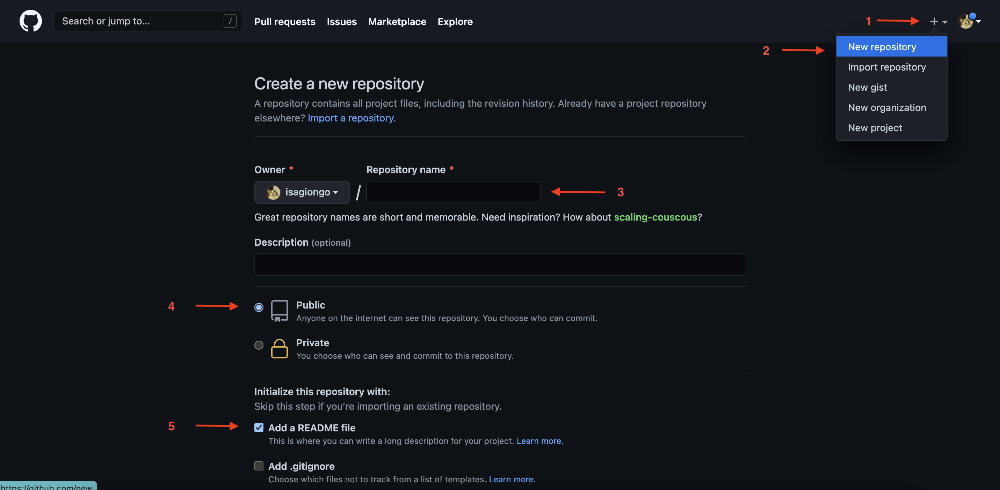

# Seu perfil do GitHub muito mais interessante 🚀 🌟

## Instruções Iniciais
Para que você tenha um **perfil** no GitHub, como uma página inicial de apresentação, falando um pouco sobre você, seus interesses, sobre as tecnologias que tem estudado ou trabalhado, os seus repositórios mais relevantes, é preciso criar um repositório seguindo alguns passos.

>Caso você ainda não tenha uma conta no GitHub, basta acessar https://github.com/ e seguir as instruções para criar uma conta de usuário.

A primeira etapa é criar um novo repositório que tenha o **_mesmo nome_** que o seu nome de usuário no GitHub. Para isso, faça o seguinte (instruções abaixo da imagem):

1. Clique no **+** que fica no canto superior esquerdo de qualquer página do GitHub.
2. Selecione, no menu que vai se abrir, a opção **New repository**.
3. Na página de criação de novo repositório, insira na caixa **Repository name**, o mesmo nome que o nome do seu usário do GitHub (no exemplo da imagem, o nome do repositório tem que ser **_isagiongo_**).
4. É preciso deixar marcado a opção **Public** para esse repositório.
5. Marque a caixinha **Add a README file**

E por fim, clique no botão, ao fim da página, **Create repository**.

Ok, a primeira parte do processo já conseguimos concluir! 👏 💯

Agora vamos editar o README e adicionar as sessões que julgamos necessárias.

1. Clique em **Edit README**

Na caixa de edição, já teremos um modelo pré-preenchido com alguns exemplos. Agora podemos inserir (copiar/colar/adaptar) o que queremos que nosso README de perfil possua.

Nos links abaixo, separados por seção, teremos alguns exemplos quase prontos para copiar e colar dentro do seu **README**. Após clicar no link escolhido, clique em **raw** para copiar o código e colar no seu README 🤯🧑‍💻

### [Exemplos de Apresentação pessoal](./exemplos/apresentacao.md)

### [Exemplos de Badges de Tecnologias](exemplos/badges-tech.md)

### [Exemplos de estatísticas do Github](exemplos/stats-repos.md)
---
Para mais exemplos, [clique aqui.](https://github.com/abhisheknaiidu/awesome-github-profile-readme) 

---

#### Referências
https://github.com/abhisheknaiidu/awesome-github-profile-readme
https://github.com/kautukkundan/Awesome-Profile-README-templates

https://github.com/aemmadi/aemmadi/blob/master/README.md
https://github.com/thmsgbrt/thmsgbrt/blob/master/README.md
https://github.com/moshfiqrony/moshfiqrony/blob/master/README.md
https://github.com/DenverCoder1/DenverCoder1/blob/master/README.md

https://github.com/Thaiane/Thaiane/blob/master/README.md
https://github.com/alinebastos/alinebastos/blob/master/README.md
https://github.com/patriciahoc/patriciahoc/blob/main/README.md

https://github.com/anuraghazra/github-readme-stats#readme

