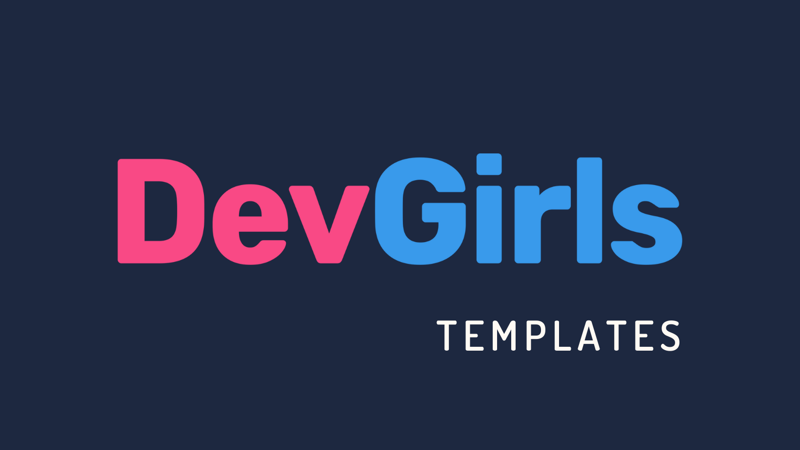

  

<h1 align="center">
  
</h1>

=================

<!--ts-->

- [Objetivo e Motivação](#objetivo-e-motivação)
- [Tecnologias](#tecnologias)
- [Escolhas das tecnologias](#escolhas-das-tecnologias)
- [Maior desafio](#maior-desafio)
- [Maior aprendizado](#maior-aprendizado)
- [Possíveis mudanças](#possíveis-mudanças)
- [Funcionalidades](#funcionalidades)
  - [Próximas features](#próximas-features)
- [Referências](#referências)
- [Agradecimentos](#agradecimentos)
- [Autora](#autora)
- [Licença](#licença)
<!--te-->

=================

## Objetivo e motivação:

_Escreva aqui_: O objetivo do projeto, ou seja, o que ele faz ou fará. E o que levou a desenvolver ele.

_Ex: Este projeto se trata de uma API Rest que consome uma API externa e retorna essas tais informações. Motivação: Por em prática meus estudos/Aprender a desenvolver uma API/Parte de um processo seletivo, etc._

## Tecnologias:

_Escreva aqui_: linguagem, frameworks, banco de dados, outras ferramentas importantes utilizadas no desenvolvimento do projeto.

_Exemplo:_

- [Node.js](https://nodejs.org/pt-br/about/);
- [Express](http://expressjs.com/);
- [MongoDB](https://www.mongodb.com/pt-br);

## Escolhas das tecnologias:

_Escreva aqui_: O que motivou a escolha das tecnologias usadas neste projeto? Ex: Familiaridade, para aprender a usar a tecnologia, por ser a mais indicada para a execução do projeto, etc.

## Maior desafio:

_Escreva aqui_: O que, na execução do projeto, você considerou mais desafiador? Ex: Ferramenta que não conhecia, dividir e estruturar a execução do projeto, tempo para execução, etc

## Maior aprendizado

_Escreva aqui_: Se tem desafio, tem aprendizado. O que aprendeu neste projeto? Pode ser tecnologias novas até organização, etc.

## Possíveis mudanças

_Escreva aqui_: Depois de concluído o projeto, o que acha que faria de diferente? Tem algo que poderia tornar o projeto ainda melhor? Sim? Mencione aqui o que e porque.

## **Funcionalidades**:

- [x] Exemplo 1:
  - [x] Exemplo 1.1;
  - [ ] Exemplo 1.2;
- [ ] Exemplo 2

### **Próximas features**:

- [ ] exemplo 1;
- [ ] exemplo 2

### **Como usar**:

_Escreva aqui_: o passo a passo para a pessoa que quiser utilizar seu projeto. Outra opção é criar um outro readme mais detalhado, caso seja algo mais complexo e com várias etapas. Nesta parte também vale tabela, vídeo, prints de tela, etc.

## Referências:

- [Informações para licenças](http://escolhaumalicenca.com.br/licencas/) ;
- [Emoji](https://emojikeyboard.io/) ;
- [Site para edição de imagem](https://www.canva.com/);
- [Dicas para um bom readme](https://dev.to/reginadiana/como-escrever-um-readme-md-sensacional-no-github-4509#o-que-%C3%A9-o-readme);
- [Awesome readme](https://github.com/matiassingers/awesome-readme) ;
- [Guia para Markdown](https://markdown.net.br/sintaxe-basica/);
- [Conversor Markdown - HTML](https://markdowntohtml.com/);
- [Badges](https://shields.io/);

## Agradecimentos:

_Escreva aqui_: Caso tenha algum agradecimento a pessoas que colaboraram com o projeto direta ou indiretamente, e caso deseje, você pode mencionar essas pessoas aqui.

---

## Autora

---

## Licença

Este projeto está sob a licença [SUA LICENÇA]
